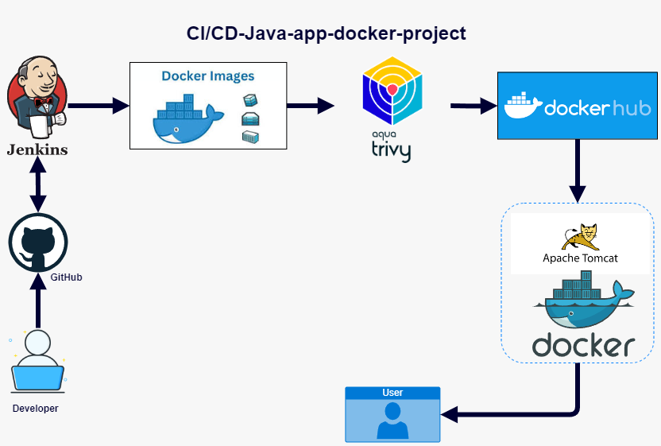

# CI/CD Pipeline for Java Application with Docker Integration
Java application containerization project

### Project Architecture

#### Project Overview:
This project is designed to implement a robust CI/CD (Continuous Integration/Continuous Deployment) pipeline for a Java application using Jenkins, Docker, and Aqua Trivy for security scanning. The primary objective is to streamline the build, scan, and deployment process, ensuring that the application is securely containerized and easily deployable on Apache Tomcat within Docker containers.

#### Key Components:
1. **Jenkins**:
   - Jenkins is used as the CI/CD orchestrator.
   - It pulls the latest code from GitHub, builds the application as a war file using maven, creates Docker images, and manages the deployment pipeline.

2. **GitHub**:
   - The source code of the Java application is hosted on GitHub.
   - Developers push code changes to the GitHub repository, triggering Jenkins to initiate the CI/CD process.

3. **Docker**:
   - Docker is used to containerize the Java application.
   - The Dockerfile is configured to build Docker images that encapsulate the Java application along with its dependencies.

4. **Aqua Trivy**:
   - Aqua Trivy is integrated into the pipeline to perform security scanning on Docker images.
   - It helps identify vulnerabilities before the images are pushed to Docker Hub, ensuring that only secure images are deployed.

5. **Docker Hub**:
   - Once the Docker image passes the security scan, it is pushed to Docker Hub, a container registry service.
   - This makes the Docker image available for deployment across different environments.

6. **Apache Tomcat**:
   - Apache Tomcat runs within the Docker container to serve the Java application.
   - The Docker container, running on a Tomcat server, is deployed to handle user requests.

7. **End-User Access**:
   - The deployed application is accessible to end-users via a web interface.
   - Users interact with the Java application, which is running inside the Docker container on Apache Tomcat.

#### Workflow:
1. **Development**: 
   - A developer commits code to the GitHub repository.
  
2. **Build and Dockerization**:
   - Jenkins automatically triggers a build job that compiles the Java code, creates a war file of the java application using maven and creates a Docker image from the Dockerfile.
  
3. **Security Scanning**:
   - The newly created Docker image is scanned using Aqua Trivy to check for any security vulnerabilities.
  
4. **Image Storage**:
   - After passing the security scan, the Docker image is pushed to Docker Hub for storage and distribution.
  
5. **Deployment**:
   - The Docker image is pulled from Docker Hub and deployed to an Apache Tomcat server running in a Docker container.

6. **User Interaction**:
   - The application is accessed by users through a web browser, and the requests are processed by the Java application running inside the Docker container.

#### Benefits:
- **Automated Pipeline**: The entire process from code commit to deployment is automated, reducing manual intervention and errors.
- **Security**: Integration of Aqua Trivy ensures that only secure images are deployed, minimizing security risks.
- **Scalability**: Docker enables easy scaling of the application by deploying additional containers as needed.

Find the link for the video demo here: https://drive.google.com/file/d/1M3epfeckOV3gh-pC4W-FcSwS5MUqLxLf/view?usp=sharing

